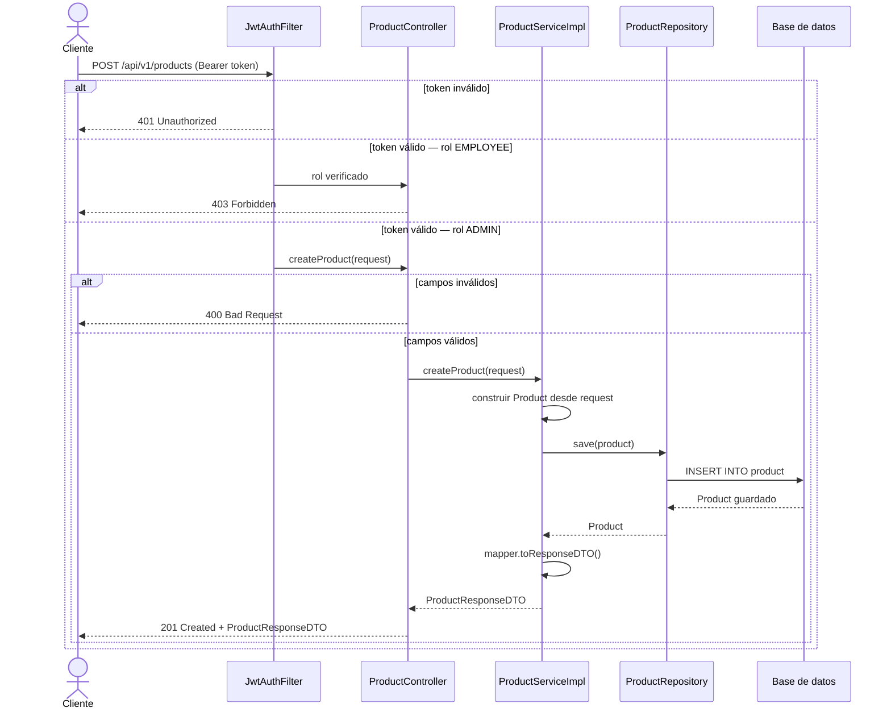

# Sequence Diagram — POST /api/v1/products
### HU-07 — Crear producto

```mermaid
sequenceDiagram
    actor Cliente
    participant Filter as JwtAuthFilter
    participant Controller as ProductController
    participant Service as ProductServiceImpl
    participant Repository as ProductRepository
    participant DB as Base de datos

    Cliente->>Filter: POST /api/v1/products (Bearer token)
    
    alt token inválido
        Filter-->>Cliente: 401 Unauthorized
    else token válido — rol EMPLOYEE
        Filter->>Controller: rol verificado
        Controller-->>Cliente: 403 Forbidden
    else token válido — rol ADMIN
        Filter->>Controller: createProduct(request)
        
        alt campos inválidos
            Controller-->>Cliente: 400 Bad Request
        else campos válidos
            Controller->>Service: createProduct(request)
            Service->>Service: construir Product desde request
            Service->>Repository: save(product)
            Repository->>DB: INSERT INTO product
            DB-->>Repository: Product guardado
            Repository-->>Service: Product
            Service->>Service: mapper.toResponseDTO()
            Service-->>Controller: ProductResponseDTO
            Controller-->>Cliente: 201 Created + ProductResponseDTO
        end
    end
```