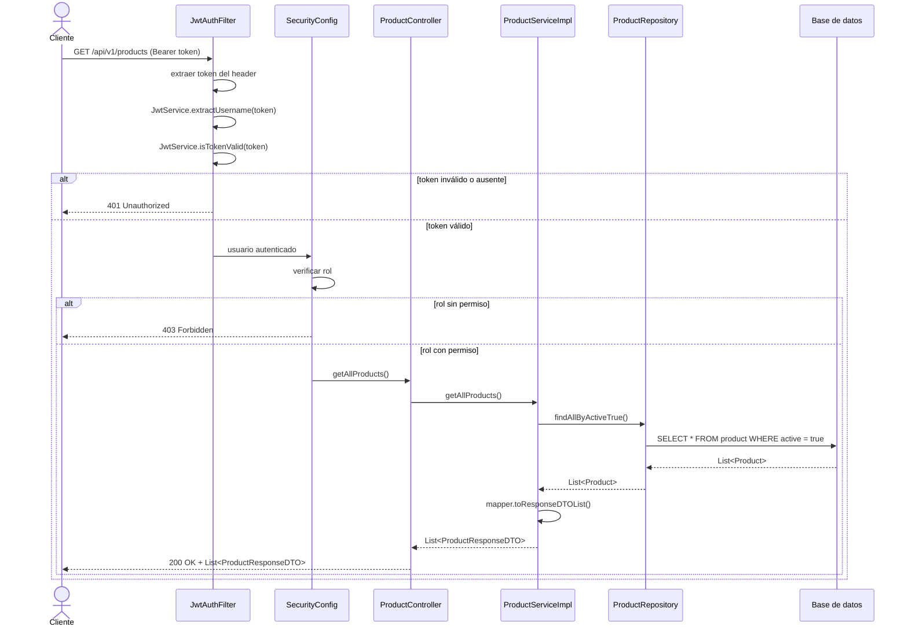

# Sequence Diagrams — Products

### GET /api/v1/products — getAllProducts

```mermaid
sequenceDiagram
    actor Cliente
    participant Filter as JwtAuthFilter
    participant Security as SecurityConfig
    participant Controller as ProductController
    participant Service as ProductServiceImpl
    participant Repository as ProductRepository
    participant DB as Base de datos

    Cliente->>Filter: GET /api/v1/products (Bearer token)
    Filter->>Filter: extraer token del header
    Filter->>Filter: JwtService.extractUsername(token)
    Filter->>Filter: JwtService.isTokenValid(token)
    
    alt token inválido o ausente
        Filter-->>Cliente: 401 Unauthorized
    else token válido
        Filter->>Security: usuario autenticado
        Security->>Security: verificar rol
        alt rol sin permiso
            Security-->>Cliente: 403 Forbidden
        else rol con permiso
            Security->>Controller: getAllProducts()
            Controller->>Service: getAllProducts()
            Service->>Repository: findAllByActiveTrue()
            Repository->>DB: SELECT * FROM product WHERE active = true
            DB-->>Repository: List<Product>
            Repository-->>Service: List<Product>
            Service->>Service: mapper.toResponseDTOList()
            Service-->>Controller: List<ProductResponseDTO>
            Controller-->>Cliente: 200 OK + List<ProductResponseDTO>
        end
    end
```