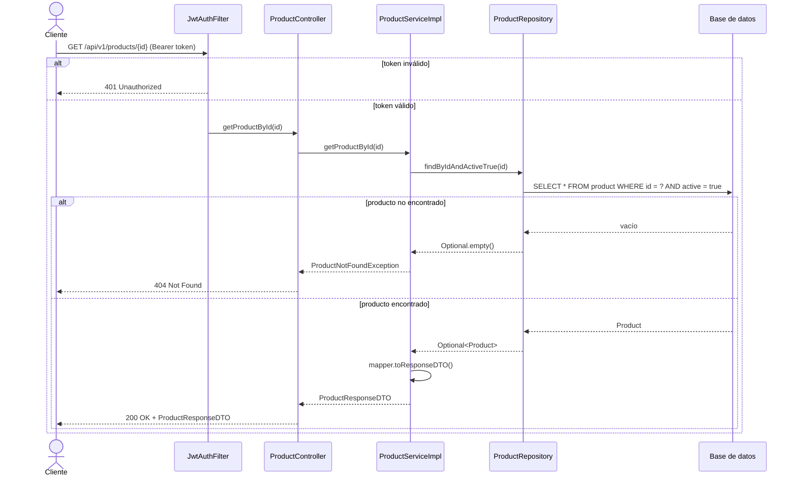

# Sequence Diagram — GET /api/v1/products/{id}
### HU-09 — Ver producto por ID

```mermaid
sequenceDiagram
    actor Cliente
    participant Filter as JwtAuthFilter
    participant Controller as ProductController
    participant Service as ProductServiceImpl
    participant Repository as ProductRepository
    participant DB as Base de datos

    Cliente->>Filter: GET /api/v1/products/{id} (Bearer token)
    
    alt token inválido
        Filter-->>Cliente: 401 Unauthorized
    else token válido
        Filter->>Controller: getProductById(id)
        Controller->>Service: getProductById(id)
        Service->>Repository: findByIdAndActiveTrue(id)
        Repository->>DB: SELECT * FROM product WHERE id = ? AND active = true
        
        alt producto no encontrado
            DB-->>Repository: vacío
            Repository-->>Service: Optional.empty()
            Service-->>Controller: ProductNotFoundException
            Controller-->>Cliente: 404 Not Found
        else producto encontrado
            DB-->>Repository: Product
            Repository-->>Service: Optional<Product>
            Service->>Service: mapper.toResponseDTO()
            Service-->>Controller: ProductResponseDTO
            Controller-->>Cliente: 200 OK + ProductResponseDTO
        end
    end
```