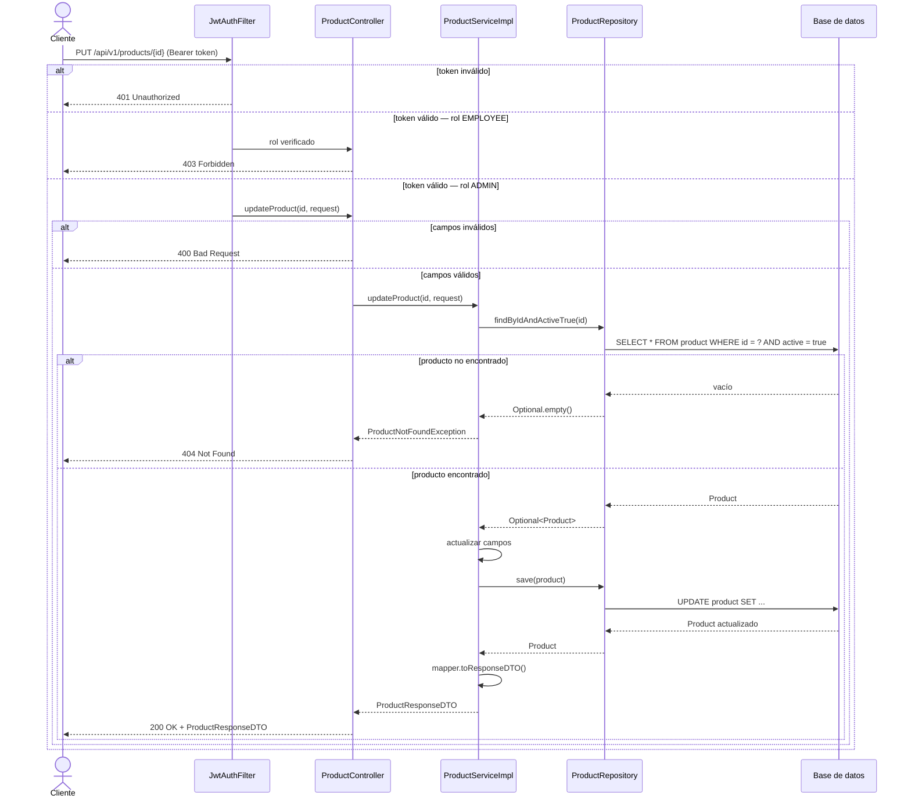

# Sequence Diagram — PUT /api/v1/products/{id}
### HU-10 — Editar producto

```mermaid
sequenceDiagram
    actor Cliente
    participant Filter as JwtAuthFilter
    participant Controller as ProductController
    participant Service as ProductServiceImpl
    participant Repository as ProductRepository
    participant DB as Base de datos

    Cliente->>Filter: PUT /api/v1/products/{id} (Bearer token)
    
    alt token inválido
        Filter-->>Cliente: 401 Unauthorized
    else token válido — rol EMPLOYEE
        Filter->>Controller: rol verificado
        Controller-->>Cliente: 403 Forbidden
    else token válido — rol ADMIN
        Filter->>Controller: updateProduct(id, request)
        
        alt campos inválidos
            Controller-->>Cliente: 400 Bad Request
        else campos válidos
            Controller->>Service: updateProduct(id, request)
            Service->>Repository: findByIdAndActiveTrue(id)
            Repository->>DB: SELECT * FROM product WHERE id = ? AND active = true
            
            alt producto no encontrado
                DB-->>Repository: vacío
                Repository-->>Service: Optional.empty()
                Service-->>Controller: ProductNotFoundException
                Controller-->>Cliente: 404 Not Found
            else producto encontrado
                DB-->>Repository: Product
                Repository-->>Service: Optional<Product>
                Service->>Service: actualizar campos
                Service->>Repository: save(product)
                Repository->>DB: UPDATE product SET ...
                DB-->>Repository: Product actualizado
                Repository-->>Service: Product
                Service->>Service: mapper.toResponseDTO()
                Service-->>Controller: ProductResponseDTO
                Controller-->>Cliente: 200 OK + ProductResponseDTO
            end
        end
    end
```