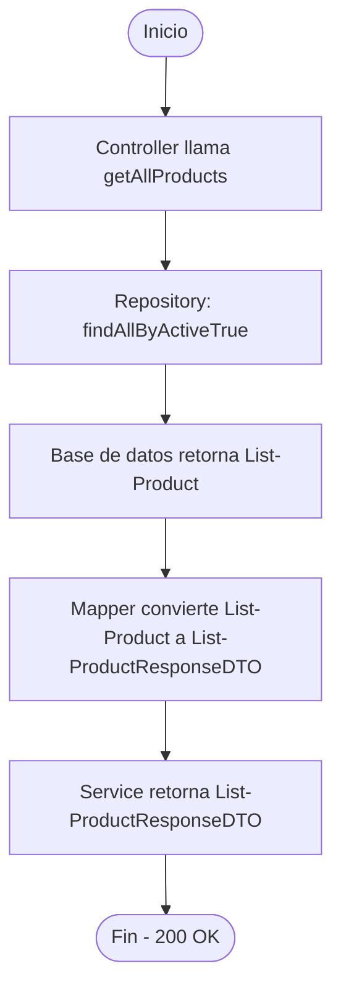

# Diagrama de flujo — getAllProducts

```mermaid
flowchart TD
    A([Inicio]) --> B[Controller llama getAllProducts]
    B --> C[Repository: findAllByActiveTrue]
    C --> D[Base de datos retorna List-Product]
    D --> E[Mapper convierte List-Product a List-ProductResponseDTO]
    E --> F[Service retorna List-ProductResponseDTO]
    F --> G([Fin - 200 OK])
```