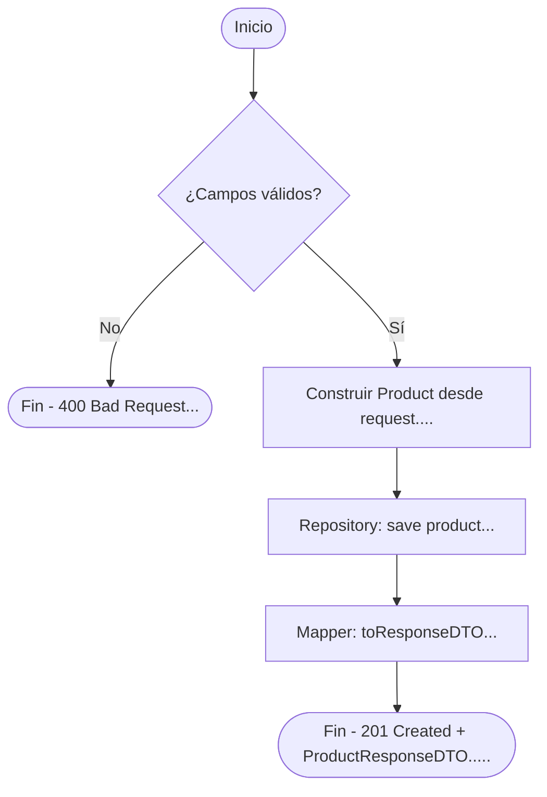

# Diagrama de flujo — createProduct

```mermaid
flowchart TD
    A([Inicio]) --> B{¿Campos válidos?}
    B -->|No| C([Fin - 400 Bad Request...])
    B -->|Sí| D[Construir Product desde request....]
    D --> E[Repository: save product...]
    E --> F[Mapper: toResponseDTO...]
    F --> G([Fin - 201 Created + ProductResponseDTO.....])
```