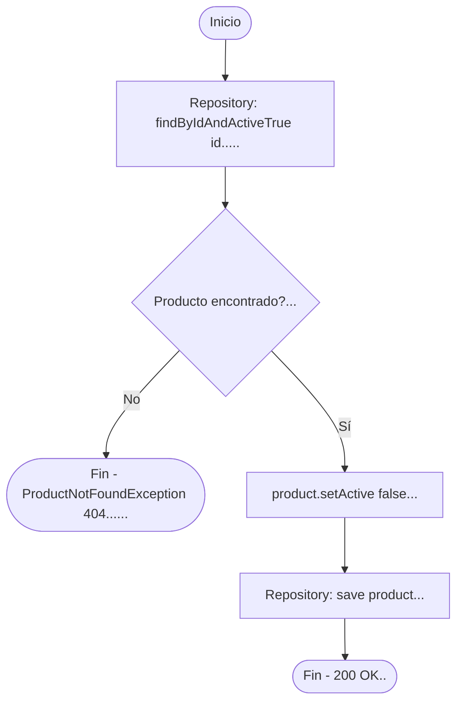

# Diagrama de flujo — deleteProduct

```mermaid
flowchart TD
    A([Inicio]) --> B[Repository: findByIdAndActiveTrue id.....]
    B --> C{Producto encontrado?...}
    C -->|No| D([Fin - ProductNotFoundException 404......])
    C -->|Sí| E[product.setActive false...]
    E --> F[Repository: save product...]
    F --> G([Fin - 200 OK..])
```