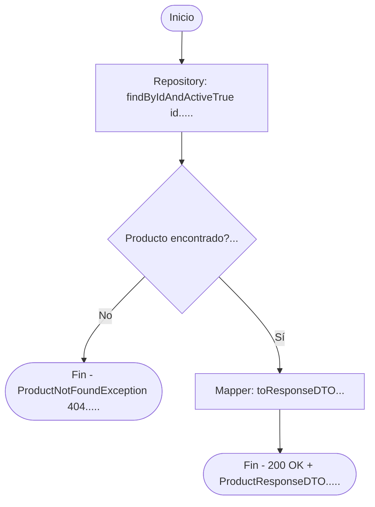

# Diagrama de flujo — getProductById

```mermaid
flowchart TD
    A([Inicio]) --> B[Repository: findByIdAndActiveTrue id.....]
    B --> C{Producto encontrado?...}
    C -->|No| D([Fin - ProductNotFoundException 404.....])
    C -->|Sí| E[Mapper: toResponseDTO...]
    E --> F([Fin - 200 OK + ProductResponseDTO.....])
```