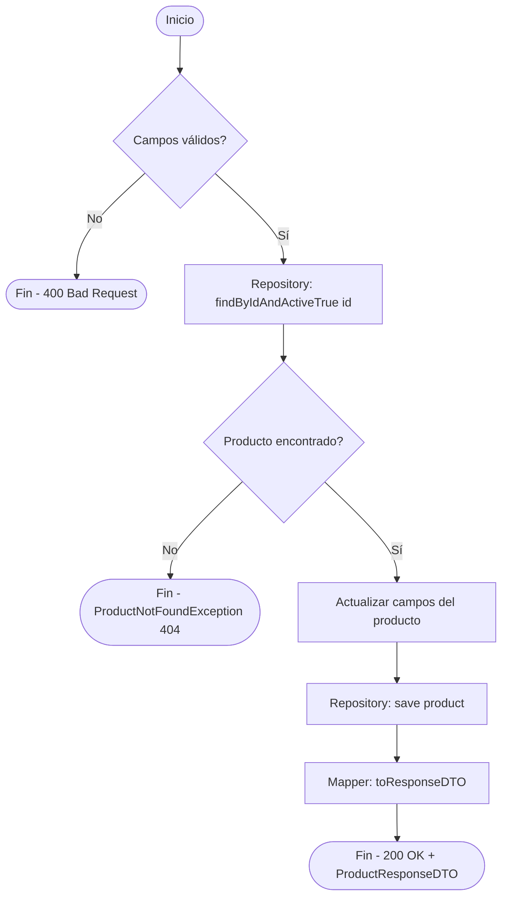

# Diagrama de flujo — updateProduct

```mermaid
flowchart TD
    A([Inicio]) --> B{Campos válidos?}
    B -->|No| C([Fin - 400 Bad Request])
    B -->|Sí| D[Repository: findByIdAndActiveTrue id]
    D --> E{Producto encontrado?}
    E -->|No| F([Fin - ProductNotFoundException 404])
    E -->|Sí| G[Actualizar campos del producto]
    G --> H[Repository: save product]
    H --> I[Mapper: toResponseDTO]
    I --> J([Fin - 200 OK + ProductResponseDTO])
```